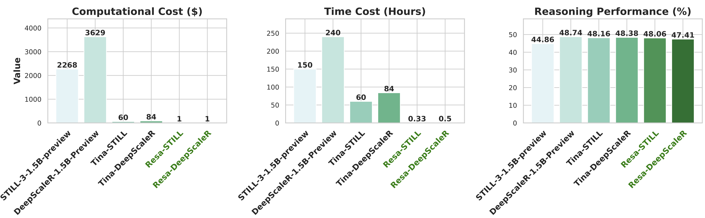
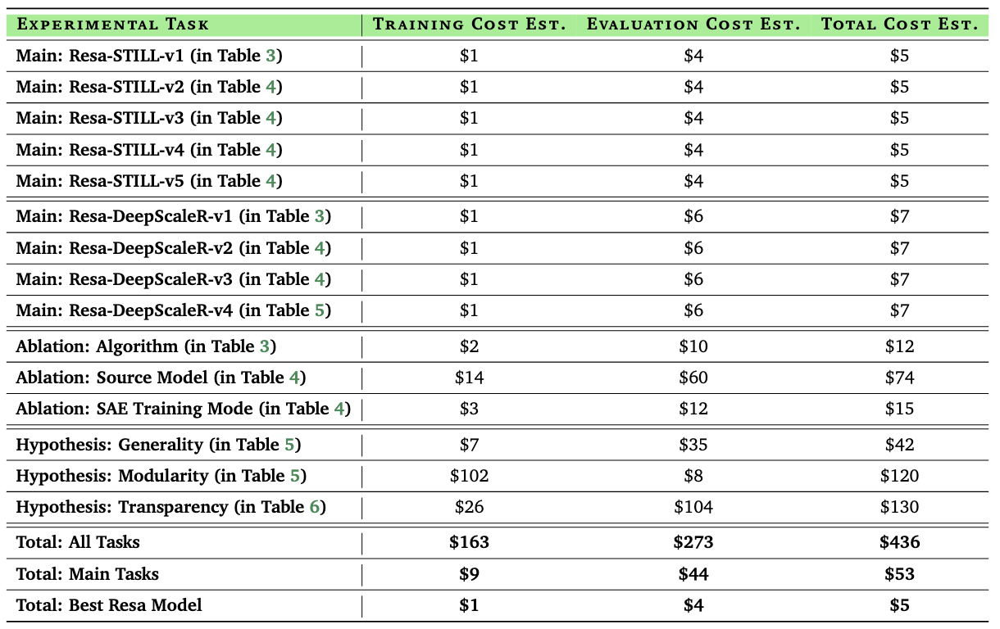
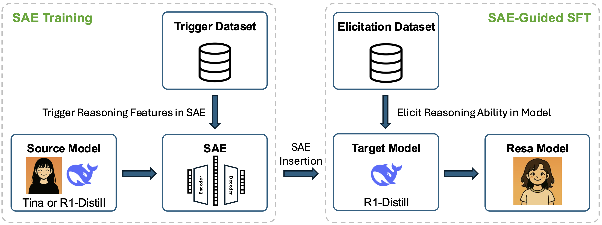
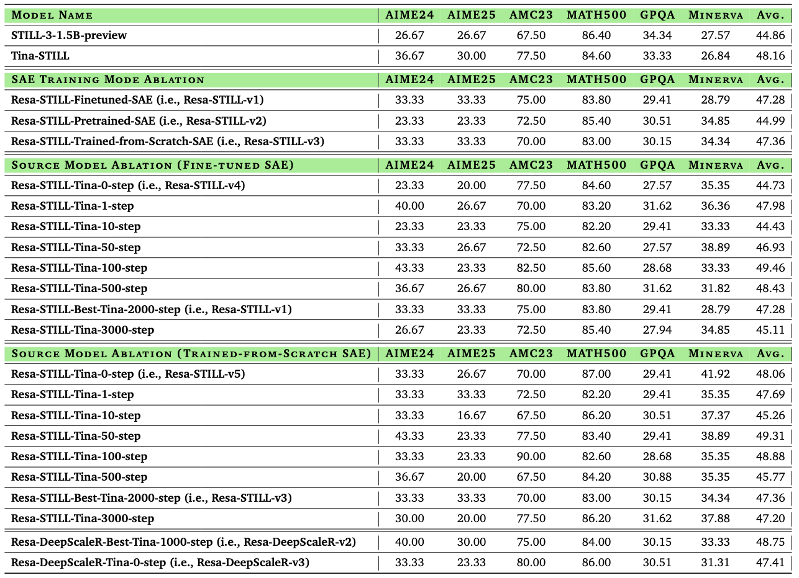

<div align="center">
  <h1 style="font-family: 'Segoe UI', Tahoma, Geneva, Verdana, sans-serif; margin-bottom: 10px;">
    Resa: Transparent Reasoning Models via SAEs
  </h1>

  <hr style="width: 60%; border: none; border-top: 2px solid #ccc; margin: 0 auto 20px auto;">

  <a href="https://github.com/shangshang-wang/Resa">    
    
  </a>
</div>

<div align="center">

[](https://github.com/shangshang-wang/Resa)
[](https://shangshangwang.notion.site/resa) 
[](https://huggingface.co/Resa-Yi)
[](https://wandb.ai/upup-ashton-wang-usc/Resa)

</div>

## Overview

This repository contains the code for the Resa project, accompanying the paper [Resa: Transparent Reasoning Models via SAEs](https://arxiv.org/abs/2506.09967). 
We in this project try to answer the question "How cost-effectively can we elicit strong reasoning in language models by leveraging their underlying representations?"
Specifically, we explore elicit reasoning capabilities in tiny language models via sparse autoencoder tuning (SAE-Tuning).

<div style="text-align: center;">
   
    </div>

Notably, when applied to certain base models before further RL post-training, SAE‑Tuning retains >97% of its RL‑trained counterpart’s reasoning performance while reducing training costs by >2000x to roughly $1 and training time by >450x to around 20 minutes.

<div style="text-align: center;">
  
    </div>


## Quick Start

### File Setup

* `./scripts/set/set_vars.sh`: contain the main env vars we use, change the path (marked with a TODO sign) to align with your own setting.
* `./resa/config.py`: contain the main configurations for this project, set default values here.
* `./resa/utils/constant.py`: contain the main datasets for each experiment in this project.

### Env Setup

Run the following commands to install the dependencies.
```bash
conda update -n base -c defaults conda -y
conda install -n base -c conda-forge mamba -y

mamba create -n resa python=3.10 -y && mamba activate resa
./scripts/set/set_env.sh && mamba deactivate

mamba create -n resa_eval python=3.11 -y && mamba activate resa_eval
./scripts/set/set_env_eval.sh && mamba deactivate

# download the pre-trained models to the `CKPT_DIR` directory.
./scripts/set/prepare.sh
```

### Training & Evaluation

SAE-Tuning:
* SAE Training: 
  * Train-from-Scratch: `./scripts/train/train_sae_from_scratch.sh`
  * Fine-tuning: `./scripts/train/finetune_sae.sh`
  * Pre-training: `./scripts/train/pretrain_sae.sh`
* SAE-Guided SFT: `./scripts/train/sae_tuning_model.sh`

<div style="text-align: center;">
  
    </div>

* Evaluate post-trained models: `./scripts/eval/eval_sae_tuning.sh`

<div style="text-align: center;">
  
    </div>

## Acknowledgements

We thank Huggingface to open source the amazing [open-r1](https://github.com/huggingface/open-r1/tree/7041fbc9d65b6f1832db727961e8282243f8f82a) project and EluetherAI's [sparsify](https://github.com/EleutherAI/sparsify). 
We also appreciate all researchers releasing their open-source reasoning datasets, including [open-r1/OpenR1-Math-220k](https://huggingface.co/datasets/open-r1/OpenR1-Math-220k), [bethgelab/CuratedThoughts](https://huggingface.co/datasets/bethgelab/CuratedThoughts), [agentica-org/DeepScaleR-Preview-Dataset](https://huggingface.co/datasets/agentica-org/DeepScaleR-Preview-Dataset), [RUC-AIBOX/STILL-3-Preview-RL-Data](https://huggingface.co/datasets/RUC-AIBOX/STILL-3-Preview-RL-Data), which are used for our training.

*Resa's avatar is generated by GPT-4o based on [KYNE](https://www.artsy.net/artist/kyne)'s girls and the following prompt.*

*Hey hey! I’m Resa — total ENTJ energy here 💥 I love meeting new people (friends are everything!!), and I’m all about chasing good vibes through amazing food, spontaneous travel, artsy sketches, and singing my heart out wherever I go! 🎨✈️🍜🎤 ... Oops, almost forget, I am super into large language model reasoning, too!*

## Citation

```cite
@misc{wang2025resatransparentreasoningmodels,
      title={Resa: Transparent Reasoning Models via SAEs}, 
      author={Shangshang Wang and Julian Asilis and Ömer Faruk Akgül and Enes Burak Bilgin and Ollie Liu and Deqing Fu and Willie Neiswanger},
      year={2025},
      eprint={2506.09967},
      archivePrefix={arXiv},
      primaryClass={cs.CL},
      url={https://arxiv.org/abs/2506.09967}, 
}
```
